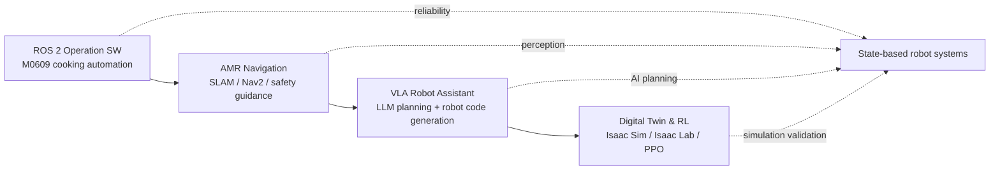
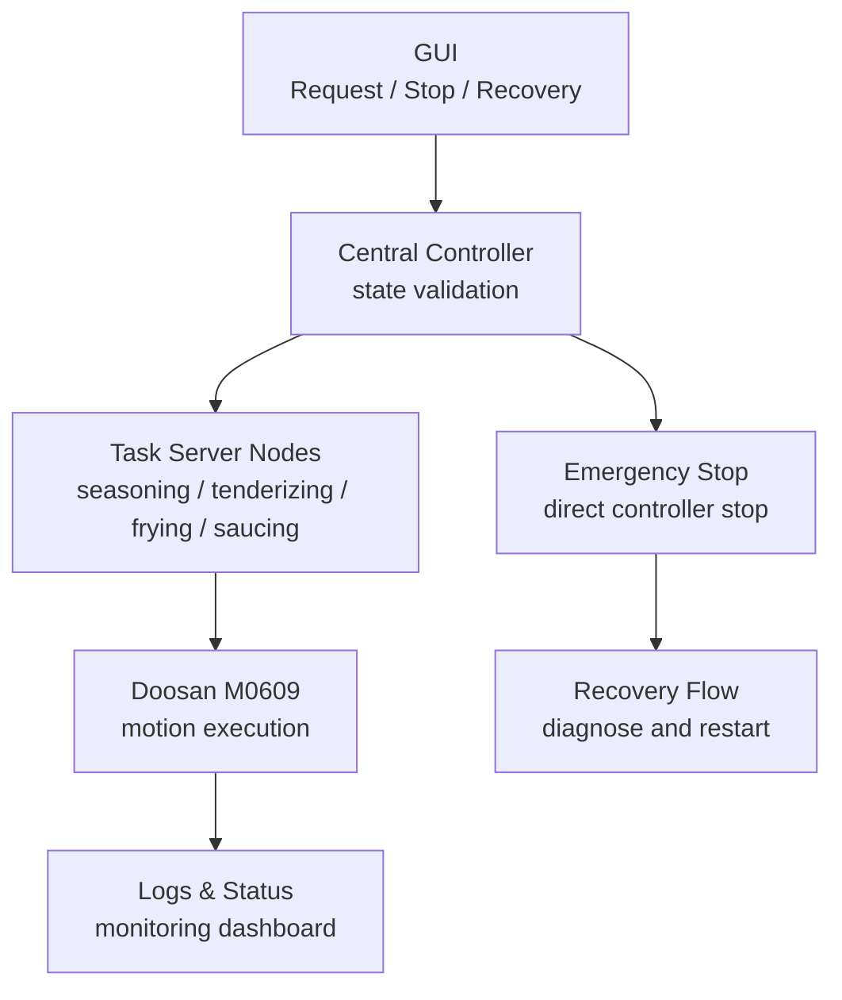
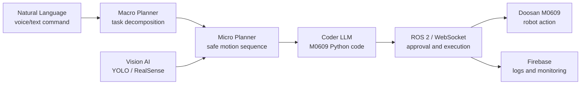
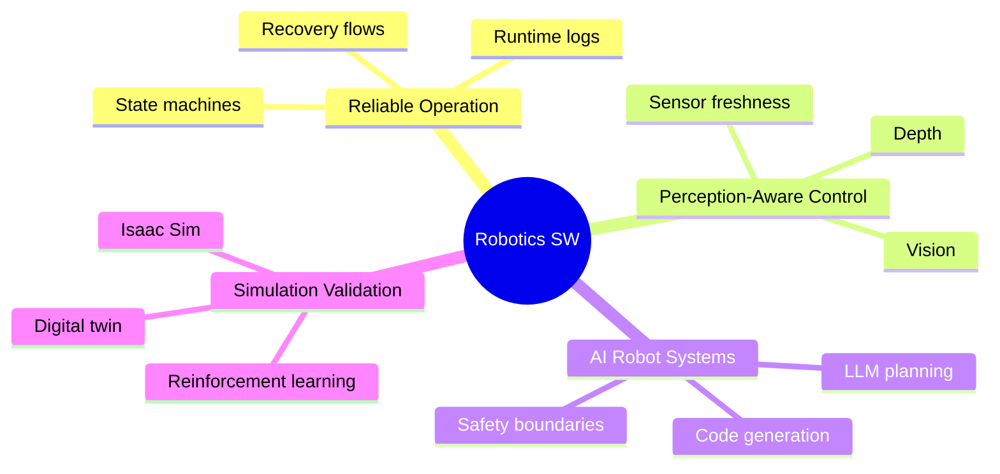

# Choi Chanwoo

### Robotics SW Engineer

Mechanism · Control · ROS 2 · Vision · Simulation · LLM/VLA

I build robot software that connects real hardware, perception, control logic, simulation, and AI agents into reliable operating systems.

---

## About Me

I am a robotics software engineer who understands both the physical side of robots and the software systems that make them useful in the real world.

My work focuses on building robot systems that do not only move once in a demo, but keep working when sensors, timing, operators, network load, and real hardware become imperfect.

| Area | What I Build |
| --- | --- |
| Robot Operation SW | ROS 2 control flows, state machines, GUI-linked operation, emergency stop, recovery |
| Autonomous Robots | SLAM, Nav2, AMR tracking, sensor-based navigation, multi-robot coordination |
| Vision & Perception | YOLO, OpenCV, RealSense, OAK-D, Depth, ArUco marker pose estimation |
| AI Robot Control | LLM/VLA task planning, robot code generation, prompt/runtime optimization |
| Digital Twin & RL | Isaac Sim, Isaac Lab, PPO, Pick & Place policy learning, TCP extension control |

---

## Tech Stack

| Category | Stack |
| --- | --- |
| Robotics |      |
| AI / Vision |      |
| LLM / VLA |    |
| Simulation / Control |     |
| Software |       |

---

## Project Map

---

## Main Projects

| Project | Core Idea | My Main Contribution | Keywords |
| --- | --- | --- | --- |
| **ROS 2 Robot Cooking Automation** | Doosan M0609-based pork cutlet cooking automation system | Central controller, state-based operation, emergency stop, recovery flow, GUI-linked monitoring | ROS 2, M0609, Flask, React, State Machine |
| **AMR Construction Site Guidance** | AMR safety guidance system for heavy equipment environments | Vehicle tracking, distance keeping, sensor delay analysis, camera/network load tuning | TurtleBot4, Nav2, SLAM, YOLO, Depth |
| **VLA Collaborative Robot Assistant** | Natural language to robot task planning and executable M0609 code | Coder LLM design, Qwen2.5-Coder integration, prompt lightweighting, 60s to 10s response improvement | VLA, LLM, Qwen, LLaMA, WebSocket |
| **Digital Twin & RL Robot Control** | Isaac Sim-based Pick & Place with reinforcement learning | Isaac Sim Extension + TCP architecture, ArUco pose estimation, PPO Pick policy design | Isaac Sim, Isaac Lab, PPO, ArUco, TCP |

---

## Project Details

### 1. ROS 2-Based Robot Cooking Automation System

> Automated pork cutlet cooking process with Doosan M0609 and ROS 2 operation software.

**Highlights**

- Built a state-based command flow between GUI, controller, and robot task modules
- Prevented duplicate execution and unsafe commands through central validation
- Implemented immediate stop and recovery logic for real robot operation
- Designed a dashboard for process status, robot logs, stop, and restart

---

### 2. SLAM and Autonomous Driving AMR Guidance System

> Construction-site AMR guidance system using SLAM, Nav2, YOLO, and Depth sensing.

| Problem | Solution |
| --- | --- |
| Camera and network latency appeared during integrated tests | Lowered camera workload to 15 fps and 640p, used compressed image transport |
| Vehicle tracking became unstable under real-time load | Tuned distance-keeping parameters and control response |
| Individual module tests were not enough | Verified sensor freshness, communication load, and controller delay in integrated operation |

**Highlights**

- Built vehicle recognition and distance-keeping tracking with RGB/Depth input
- Connected perception output to ROS 2 driving control
- Worked with TurtleBot4, SLAM Toolbox, Nav2, AMCL, OAK-D/Depth camera, and LiDAR

---

### 3. VLA-Based Collaborative Robot Assistant

> Semantic AI assistant that turns natural language instructions into executable robot control logic.

**Highlights**

- Designed a Macro Planner, Micro Planner, and Coder LLM architecture
- Built Coder LLM flow using Qwen2.5-Coder for M0609 control logic generation
- Reduced Coder LLM response time from about **60s to 10s** through prompt lightweighting and template-based code merging
- Connected vision, gesture fallback control, Firebase logging, and robot execution

---

### 4. Digital Twin and Reinforcement Learning Robot Control

> Isaac Sim and Isaac Lab-based Pick & Place simulation with PPO policy learning.

| Component | Implementation |
| --- | --- |
| Simulation | Isaac Sim, Isaac Lab, M0609, suction gripper, RealSense-style camera |
| Perception | ArUco marker detection and camera-to-world coordinate transformation |
| Policy | PPO-based Pick policy with approach, suction, lifting, and stabilization phases |
| Runtime Architecture | Isaac Sim Extension handles Stage control, external TCP client sends commands |

**Highlights**

- Verified ArUco marker pose estimation with about **1 mm** error against ground truth
- Built relative observation values from end-effector and marker positions
- Solved Python 3.10 ROS 2 and Python 3.11 Isaac Sim context conflicts using an Extension + TCP server structure
- Separated external command transmission from internal simulation execution for stable automation

---

## Engineering Direction

I want to keep building robot systems that combine reliable operation software, perception-aware control, simulation-based verification, and AI agents that can plan or generate behavior without losing safety boundaries.

---

## Contact

| Channel | Link |
| --- | --- |
| GitHub | [github.com/choichanwoo788](https://github.com/choichanwoo788) |
| Email | [chlcksdn27@naver.com](mailto:chlcksdn27@naver.com) |
